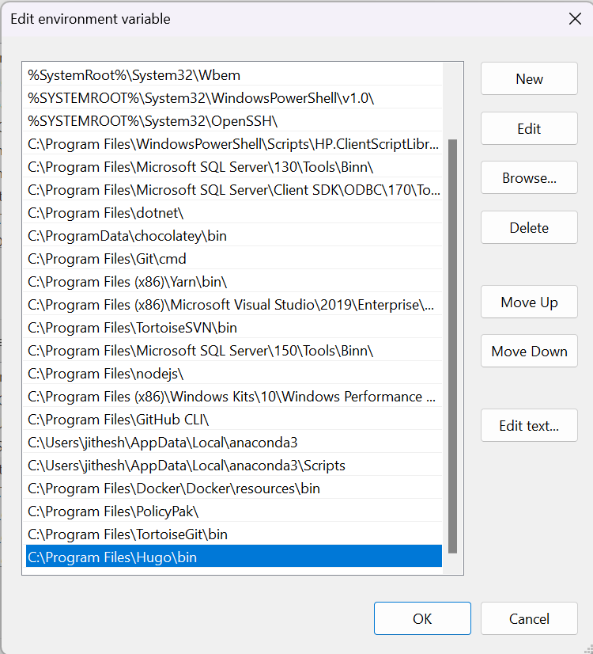
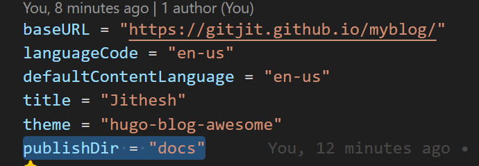
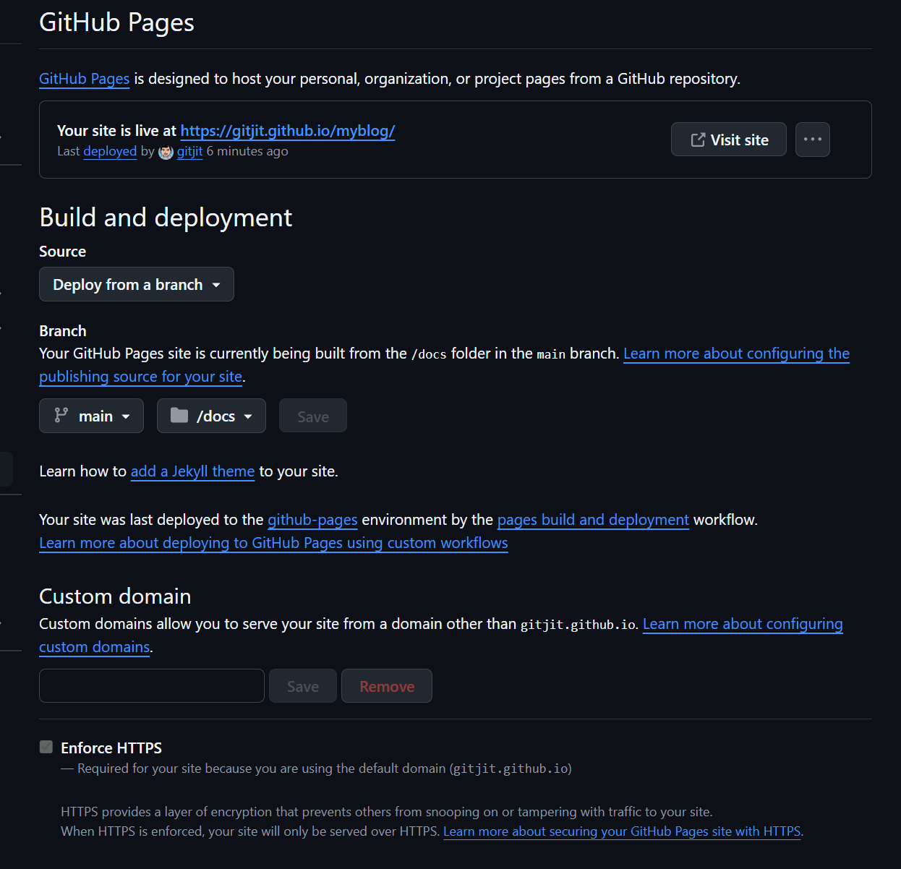

+++
title = 'Hugo Essentials'
date = 2024-09-02T12:54:03-07:00
categories = ["Hugo"]
tags = ["React", "Hooks"]
toc = true
+++


## Getting Started 

To install Hugo in my windows PC, all I did was download the binary image (x64). Create a folder Hugo/bin in the Program Files and paste it there. Then edited the System Environment variable and add that to the path.  Please refer the video.



[How to Install Hugo on Windows - YouTube](https://www.youtube.com/watch?v=8BrADPJgA-4&t=170s)

Now with hugo installed let us create a site as shown below. 

```sh
hugo new site hugo-demo
```

[Hugo Tutorials. - YouTube](https://www.youtube.com/playlist?list=PLpc_YvcwbxaQu4yAYSs9J_7sK3cq5vFTx)

## Adding Theme
I am using a theme called `hugo-blog-awesome` and planning to use it as a submodule. 

```sh
git init
git submodule add https://github.com/hugo-sid/hugo-blog-awesome.git themes/hugo-blog-awesome
```

## Setup Config 

```yaml
baseURL = "https://jithesh.io/"

languageCode = "en-us"

defaultContentLanguage = "en-us"

title = "Jithesh"

theme = "hugo-blog-awesome"

  

[markup]

  [markup.highlight]

    noClasses = false

  

  [markup.goldmark.renderer]

    unsafe = true

  

  [markup.tableOfContents]

    startLevel = 2   # ToC starts from H2

    endLevel = 4     # ToC ends at H4

    ordered = false  # Generates <ul> instead of <ol>

  

[languages]

  [languages.en-us]

    languageName = "English"

  

    [languages.en-us.menu]

      [[languages.en-us.menu.main]]

        pageRef = "/"

        name = "Home"

        url = "/"

        weight = 10

  

      [[languages.en-us.menu.main]]

        pageRef = "posts"

        name = "Posts"

        url = "/posts/"

        weight = 20

  

      [[languages.en-us.menu.main]]

        pageRef = "about"

        name = "About"

        url = "/about/"

        weight = 30

  

      [[languages.en-us.menu.main]]

        pageRef = "categories"

        name = "Categories"

        url = "/categories/"

        weight = 40

  

    [languages.en-us.params]

      [languages.en-us.params.author]

        avatar = "avatar.png"  # Ensure this file is placed in the assets folder

        intro = "Jithesh Chandrasekharan"

        name = "Jithesh Chandrasekharan"

        description = "A passionate software engineer sharing insights and experiences across evolving technologies."
```

Paste your avatar.png in the assets folder of your blog. Ensure that image is a square image. 

## Creating Posts and Pages  
This create a new post in content/posts/react folder. In order to keep the images for a post next to it , I am doing paged bundle. That means the content should be in index.md and images next to it in the same folder. 

- **Leaf Page Bundle**: When Hugo sees a directory with an `index.md` file, it treats that directory as a **leaf bundle**, meaning that everything in the directory (like images, videos, etc.) is considered part of the same "page."
- **Page Resources**: Any images or resources placed in the same folder will be available for use within that page, and you can reference them directly in your Markdown.

Example : 
```
content/
└── posts/
    └── my-post/
        ├── index.md  # This is your post
        └── image.png  # This is your image

```
In your `index.md` file, you can reference the image like this: 

``

To create a page in Hugo using a **leaf page bundle**, you'll need to follow a specific directory structure. A **leaf page bundle** consists of an `index.md` file inside a directory, along with any resources (images, files, etc.) you want to associate with that page.

Here’s a step-by-step guide:  

### Step 1: Create the Directory for Your Leaf Page Bundle

Navigate to the `content/` directory of your Hugo project and create a new directory for your page. This directory will hold the `index.md` file and any associated resources (like images).

```bash
mkdir -p content/posts/my-leaf-page
```

This creates a directory named `my-leaf-page` under `content/posts/`.

### Step 2: Create the `index.md` File

Inside the newly created directory, create an `index.md` file. This is where the content for the page will go.

```bash
touch content/posts/my-leaf-page/index.md
```

### Step 3: Add Content to the `index.md` File

Open `index.md` in your favorite text editor, and add the following front matter and content:

```md
+++
title = "My Leaf Page"
date = 2024-09-03T18:00:00-07:00
categories = ["Category1"]
tags = ["Tag1", "Tag2"]
+++

## This is a Leaf Page Bundle

Here’s an image from the same folder:


```

- The **front matter** (`+++`) contains metadata like the title, date, categories, and tags.
- You can add Markdown content below the front matter.

### Step 4: Add Resources (Optional)

If you have any resources, such as images, that you want to include with the page, place them in the same directory. For example, if you want to include an image, save it as `image.png` in the `my-leaf-page/` directory:

```
content/
└── posts/
    └── my-leaf-page/
        ├── index.md
        └── image.png
```

### Step 5: Reference Resources in the Page

In your `index.md`, you can now reference the image using a relative path:

```md

```

Hugo will automatically handle the image as part of the leaf page bundle, and the image will be copied to the appropriate location during the build process.

### Step 6: Build and Test the Site

After creating the leaf page bundle, you can run Hugo's development server to test the page locally:

```bash
hugo server
```

Visit the local development server (usually `http://localhost:1313`) and navigate to the new page, which will be available at `http://localhost:1313/posts/my-leaf-page/`.

### Summary:

1. **Create a directory** under `content/` (e.g., `content/posts/my-leaf-page`).
2. **Create an `index.md` file** in the directory.
3. Add your **page content** and any **resources** (like images) to the same directory.
4. **Reference resources** with relative paths (e.g., ``).
5. **Build and test** the site using `hugo server`.

By using this structure, you're creating a **leaf page bundle**, and Hugo will treat everything in that directory as part of the same page, allowing you to easily manage content and resources together.

Let me know if you need further help!

## Deployment  

For simplicity I am using git hub pages docs deployment. That means we have to move our files publish folder to docs instead of public and we have to set the gh-pages options in Git Hub settings.

Update hugo.toml to set publish directory.





Every time you make any changes or add posts, you have to run manually hugo command that will move the files to docs folder and you need to commit and push. 
`$hugo`

## Adding Tags/Categories overriding the Theme

Here's a summarized guide of how we added and customized **Categories** in Hugo, using `terms.html` for rendering, along with custom CSS styling:

---

### 1. **Creating and Customizing the `terms.html` for Categories**

To customize how categories are displayed, we created a `terms.html` file, placed it in your site's `_default` layout folder to override the theme's default layout, and customized it to display categories with post counts and the last post date.

#### Steps:
- **Create the `terms.html` file**:
  - File path: `layouts/_default/terms.html`.
  - This file is responsible for rendering the list of categories (terms) on the categories page.

#### Sample `terms.html`:

```html
{{- define "main" -}}
<div class="wrapper list-page">
    <header class="header">
        <h1 class="header-title center">{{ .Title }}</h1>
    </header>
    <main class="page-content" aria-label="Content">
        <!-- Loop through categories and display them -->
        {{ range .Data.Terms }}
        <div class="category-item row">
            <!-- Category Name with Post Count -->
            <div class="category-name column">
                <a href="{{ .Page.Permalink }}">{{ .Page.Title }} ({{ .Count }})</a>
            </div>
            <!-- Last Post Date -->
            <div class="category-last-date column">
                {{ with (index .Pages.ByDate 0) }}
                    {{ .Date.Format "2 Jan 2006" }}
                {{ else }}
                    No posts
                {{ end }}
            </div>
        </div>
        {{ end }}
    </main>
</div>
{{- end -}}
```

### 2. **Adding and Customizing CSS for Categories**

To apply custom styling for categories, we created a `custom.scss` file, placed it in the `assets/scss` folder, and referenced it in the `head.html` file.

#### Steps:
- **Create the `custom.scss` file**:
  - File path: `assets/scss/custom.scss`.
  - This file contains the custom styles for the categories page.

#### Sample `custom.scss`:

```scss
.category-item {
    display: flex;
    justify-content: space-between;
    padding: 10px 0;
    border-bottom: 1px solid #333;
}

.category-name {
    flex: 1;
    font-weight: bold;
}

.category-last-date {
    text-align: right;
    color: #999;
}
```

### 3. **Modifying `head.html` to Include Custom CSS**

To ensure that the custom CSS is applied, we copied the `head.html` file from the theme and modified it to include our custom SCSS file. We placed the modified `head.html` in the `layouts/partials` folder in our site.

#### Steps:
- **Copy the `head.html` from the theme**:
  - File path: `themes/<your-theme>/layouts/partials/head.html`.
  - Copy it to: `layouts/partials/head.html` in your site folder.

- **Modify `head.html` to include custom SCSS**:
  Add the following code to `head.html` to compile and include your `custom.scss`:

```html
{{- $style := resources.Get "sass/main.scss" | resources.ExecuteAsTemplate "style.scss" . | toCSS (dict "targetPath" "style.css") | minify | fingerprint }}
<link href="{{ $style.RelPermalink }}" rel="stylesheet">

<!-- Add custom SCSS file -->
{{- $customStyle := resources.Get "scss/custom.scss" | toCSS | minify | fingerprint }}
<link href="{{ $customStyle.RelPermalink }}" rel="stylesheet">
```

### 4. **Test Your Site**

Once you've added the `terms.html`, custom SCSS, and updated `head.html`, test your site to make sure the categories page is rendered correctly with the custom styles.

#### Steps:
- Run Hugo locally to verify the changes:
  ```bash
  hugo server
  ```
- Navigate to `/categories/` to see if the categories are listed with their names, post counts, and last post date, along with the custom styling.

---

### Summary of Steps:
1. **Override Categories Template**:
   - Create `terms.html` in `layouts/_default/terms.html` to customize how categories are rendered.
   - Display category name, post count, and last post date.
  
2. **Add Custom Styles**:
   - Create `assets/scss/custom.scss` for styling categories.
  
3. **Modify `head.html`**:
   - Copy `head.html` from the theme to `layouts/partials/head.html`.
   - Add the custom SCSS reference in `head.html` to include it in your site.

4. **Test Your Site**:
   - Run Hugo and navigate to the categories page to ensure everything works as expected.

---

This approach allows you to fully customize how your categories page looks and behaves while maintaining separation from the theme for easier future updates. Let me know if you need any further clarification!


## References

[Hugo Blog Tutorial: Setting up Hugo and installing a theme - YouTube](https://www.youtube.com/watch?v=cev4gGE41e8&list=PLpc_YvcwbxaQu4yAYSs9J_7sK3cq5vFTx)
