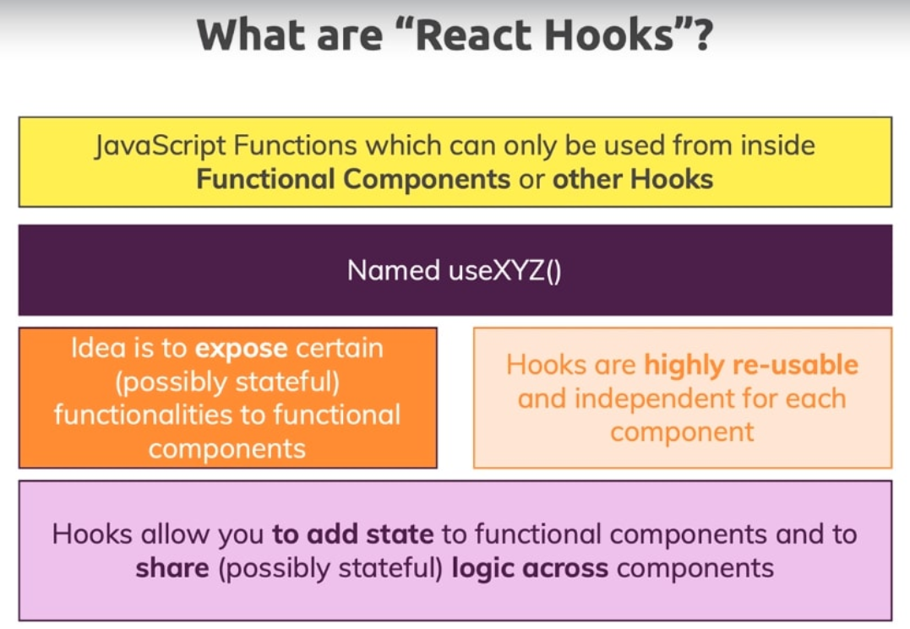

+++
title = 'React Hooks'
date = 2024-09-03T12:54:03-07:00
categories = ["React", "FullStack"]
tags = ["React", "Hooks"]
+++

## React Hooks  



As React applications grow, managing state across multiple components can become complex and difficult to maintain. This is where Redux comes in, providing a predictable state management solution that helps developers maintain consistency across their applications. In this post, we’ll explore Redux, specifically using Redux Toolkit, to make our state management simpler and more efficient.

In React, Hooks are special functions that let you use React features like state and lifecycle methods in functional components. Before React Hooks were introduced, only class components could manage state and lifecycle events. Hooks enable developers to use functional components with all the capabilities that class components had, such as managing local component state, side effects, context, and more.

React introduced Hooks in version 16.8, and they have become the standard way to write React components since they provide a simpler and more flexible approach.

## Why React Hooks?  

1. Simplifies Component Logic:
Hooks allow you to manage component logic and state without the complexity of class components. With functional components and Hooks, your code can be more straightforward and concise.

2. State and Side Effects in Functional Components:
Previously, functional components were stateless. If you needed state or to handle side effects (e.g., data fetching or timers), you had to use class components. Hooks enable state and side effect management in functional components, making functional components more powerful.

3. Reusability of Logic:
Hooks enable the reuse of stateful logic between components without changing the component hierarchy. You can extract custom Hooks to share functionality between components, unlike Higher-Order Components (HOCs) or render props, which can lead to more complex component trees.

4. Clean and Maintainable Code:
Hooks reduce the amount of boilerplate code that comes with class components. You don’t have to deal with this keyword, constructors, or binding methods in functional components, making the code easier to understand and maintain.  

## Use State Hook  

Purpose: To add state to functional components.
Usage:
```js
import React, { useState } from 'react';

function Counter() {
  // Declare a new state variable, called "count"
  const [count, setCount] = useState(0);

  return (
    <div>
      <p>You clicked {count} times</p>
      <button onClick={() => setCount(count + 1)}>
        Click me
      </button>
    </div>
  );
}
```
useState returns an array with two elements: the current state value and a function to update the state.
Whenever the state changes, the component re-renders.

## References  

https://dev.to/pratham10/all-you-need-to-know-about-react-hooks-54p0
