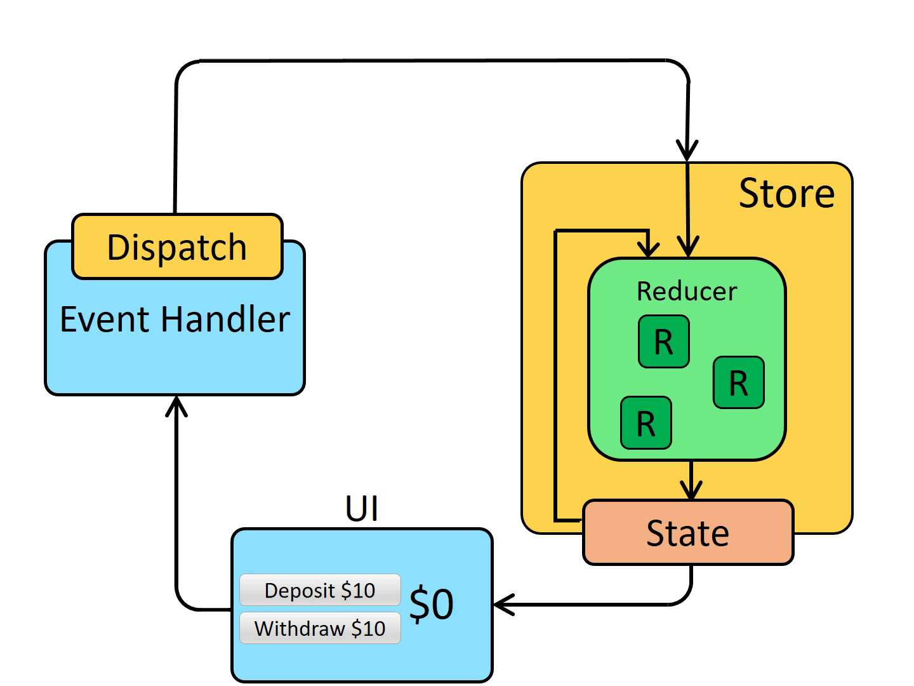

+++
title = 'Redux Essentials'
date = 2024-09-04T12:54:03-07:00
categories = ["React"]
+++

## Why Redux ?  

As React applications grow, managing state across multiple components can become complex and difficult to maintain. This is where Redux comes in, providing a predictable state management solution that helps developers maintain consistency across their applications. In this post, we’ll explore Redux, specifically using Redux Toolkit, to make our state management simpler and more efficient.

